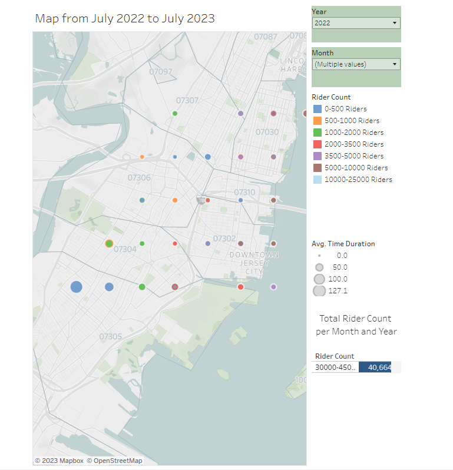
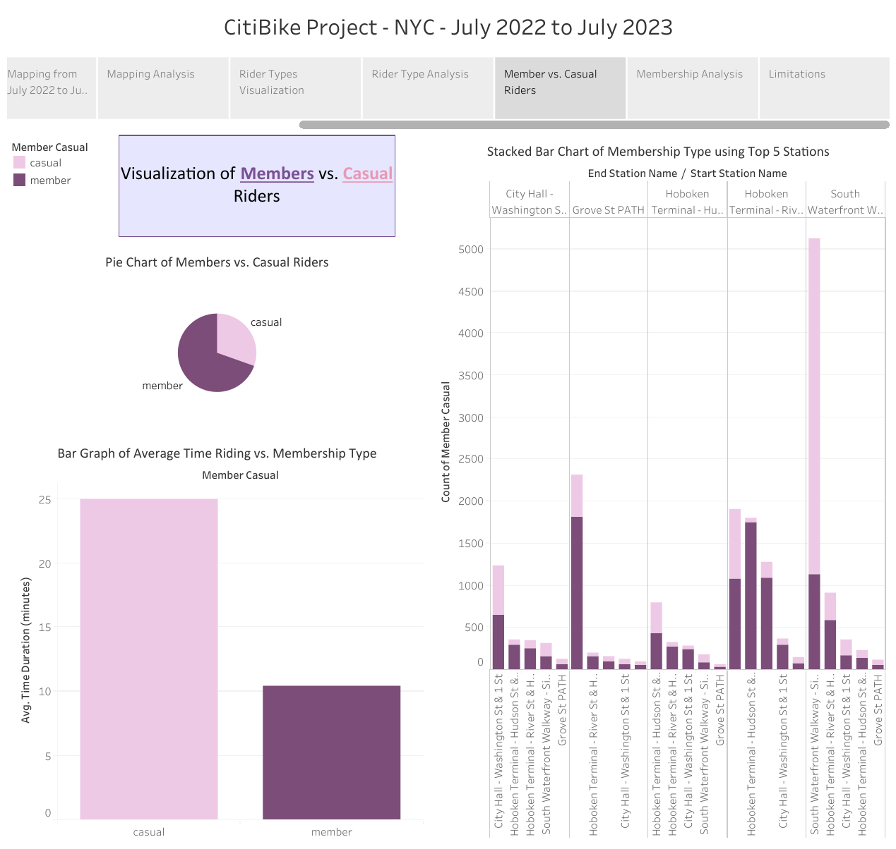
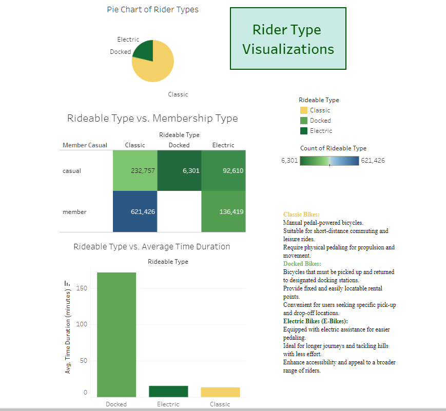
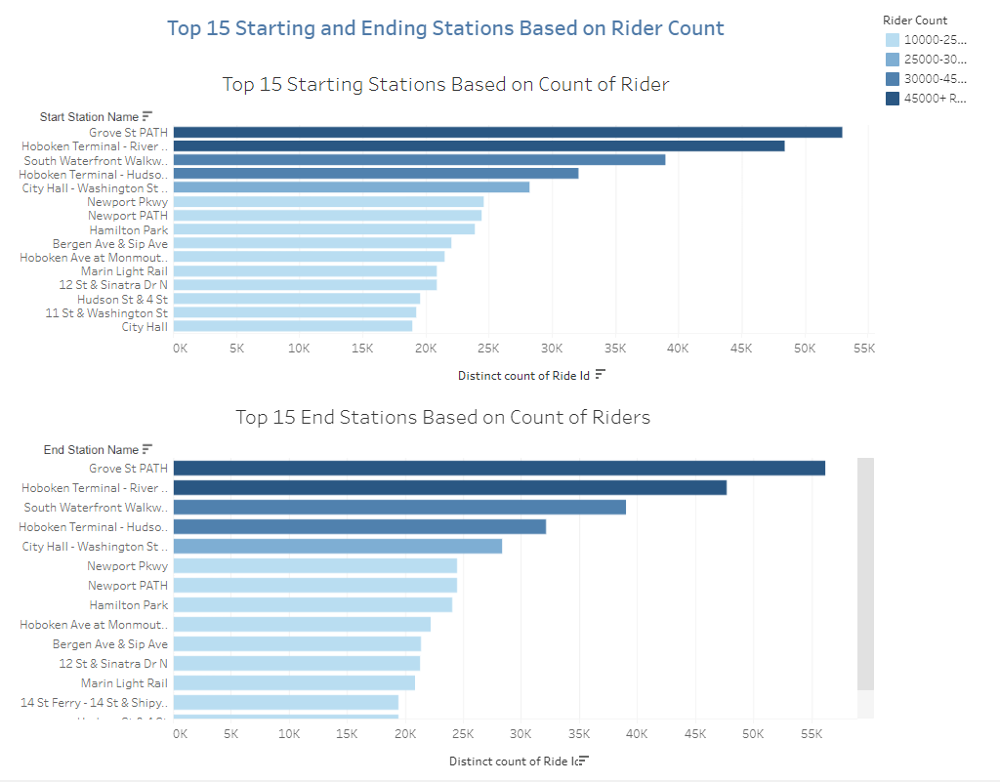

# Citi Bike Project Analysis - July 2022 to July 2023

## Introduction

This ReadMe documents the analysis of the New York Citi Bike project data spanning from July 2022 to July 2023. The analysis includes a map analysis, membership analysis, rider type analysis, and the identification of the top 15 bike stations.

## Data Sources

The data used for this analysis was sourced from the Citi Bike program's historical trip data records for the specified time frame.
https://citibikenyc.com/system-data

## Map Analysis

### Methodology
- To conduct the map analysis, I utilized the latitude and longitude coordinates of Citi Bike stations.
- I created a dynamic map in Tableau that visualized the popularity of stations over time analyzing rider count, and duration of each trip.
- Zip code data was overlaid on the map to provide additional geographical context.

## Membership Analysis

### Methodology
- For the membership analysis, I focused on tracking the growth of Citi Bike memberships over the year comparing casual riders versus those with a membeership.
- I calculated the percentage of members versus casual riders.
- Analyzed the top 5 stations to see which ones had more members versus casual riders. 
- Looked how the average duration of rides for members versus casual riders. 

## Rider Type Analysis

### Methodology
- Analyzed whether users used electric, docked, or classic bikes. 
- Looked at average duration of rides compared to the type of bike.
- Looked at what type of bikes members versus casual riders used.  

## Top 15 Stations Analysis

### Methodology
- To identify the top 15 stations, I analyzed the data on starting and ending stations for each trip and looked at the amount of riders throughout the July 2022 to Juley 2023 period. 

## Conclusion

This analysis of the New York Citi Bike project data from July 2022 to July 2023 has provided valuable insights into ridership patterns, station popularity, and membership trends. The map analysis highlighted geographical variations, the membership analysis showcased substantial growth, and the rider type analysis indicated a shift towards long-term subscriptions. Additionally, the identification of the top 15 stations offers actionable insights for program optimization.

This analysis serves as a valuable resource for city officials and program administrators to make data-driven decisions for the Citi Bike project in New York City.

---

*Note: Detailed visualizations and additional insights can be accessed in the full analysis report and dashboards.*
